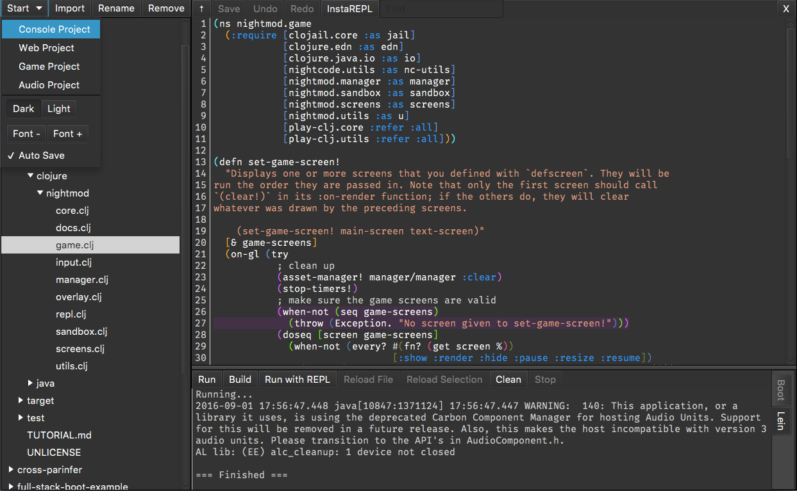

## Introduction

Nightcode is a simple IDE for Clojure and ClojureScript. Do `boot run` for development and `boot build` to make a jar file. To build, JDK 8 or above is required. On Linux, you'll also need to install the `openjfx` package.

## Licensing

All files that originate from this project are dedicated to the public domain. I would love pull requests, and will assume that they are also dedicated to the public domain.
